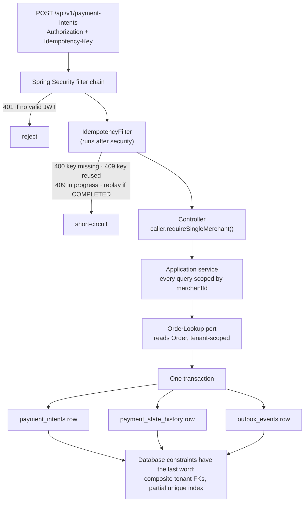

# PayMesh

PayMesh is a Payment-as-a-Service backend: multi-tenant merchant onboarding, customers,
orders, payment intents, and — eventually — providers, a double-entry ledger, refunds,
balances, settlements and webhooks. It exists to model the parts of a payment platform
that are genuinely hard (retries, duplicate delivery, tenant isolation, state machines,
auditability) rather than the parts that are CRUD.

It is a single Spring Boot application, Java 21, PostgreSQL, Flyway. **All eight of Phase 1's
capabilities are built.**

## What this is not

**PayMesh processes no real money.** It stores no real card details, connects to no
acquirer or card network, and claims no PCI, banking or payment-industry compliance. It
is an educational and portfolio project. Nothing here has been assessed for production
use, and the open items in
[`docs/project-status.md`](docs/project-status.md#open-items-worst-first) are not a
backlog of polish — they include plaintext PII, unrevocable access tokens and an
unauthenticated write endpoint with no rate limit.

## The governing invariant

> A request may fail or be retried, but committed money movement must never be lost,
> silently duplicated, or become unauditable.

Every structural decision below exists to defend that sentence. Four of them are already
in the code, and each is enforced by the database rather than by an application check
that can be bypassed, forgotten, or lost to a race:

| Mechanism | Where | What it prevents |
|---|---|---|
| **PostgreSQL-backed idempotency** | `shared.idempotency`, `idempotency_records` (V4), [ADR-009](docs/decisions/ADR-009-idempotency-for-public-writes.md) | A retried write executing twice. The record is inserted and committed in its own transaction *before* the handler runs; the primary key picks the winner. Records are deleted on 5xx so a retry is a real retry. |
| **Transactional outbox** | `shared.outbox`, `outbox_events` (V7), [ADR-010](docs/decisions/ADR-010-transactional-outbox-in-postgresql.md) | A state change that commits without its event, or an event published for a change that never committed. Both rows go in the caller's transaction. |
| **Composite tenant foreign keys** | `fk_orders_customer`, `fk_payment_method_tokens_customer`, `fk_payment_intents_order` (V5, V6, V8) | A row naming merchant A and a customer or order belonging to merchant B. The FK is on `(merchant_id, customer_id)`, not `customer_id` alone, so PostgreSQL refuses the insert with no application code in the path. |
| **One live intent per order** | `uq_payment_intents_live_per_order` (V8), [ADR-011](docs/decisions/ADR-011-one-live-payment-intent-per-order.md) | Collecting twice for one obligation. A partial unique index over `(merchant_id, order_id)` excluding exactly `FAILED` and `CANCELLED`. Two concurrent creates for one order produce exactly one intent. |

In each case the application also performs a pre-check. The pre-check exists only to
return a readable 409 or 422 instead of a constraint-violation 500 — the integration
tests bypass it and still pass, because the constraint is the guard.

## Current status

**All eight of Phase 1's capabilities are built**, and Payment is feature-complete:
create, attach, confirm, provider callbacks, capture and cancel, with order expiry and
stranded-payment sweeps behind them. **Domain events are now delivered**: the outbox has a
relay, an in-process dispatcher and a `processed_events` inbox, and Order consumes
`payment.succeeded` ([ADR-016](docs/decisions/ADR-016-in-process-event-dispatch-before-kafka.md)).
The **Provider Simulator** drives the whole loop end to end without a hand-signed request, and
the **Ledger** now posts a balanced double-entry journal when it does — so a merchant has a
balance, which was not true of this codebase before
([ADR-018](docs/decisions/ADR-018-post-the-ledger-from-events-with-the-invariants-in-the-database.md)).
**Refund** closes the loop in the other direction: money goes back out, the Ledger posts a
reversal, and the payment reaches `REFUNDED`
([ADR-019](docs/decisions/ADR-019-refunds-own-their-callback-route-and-guard-over-refund-with-a-lock.md)).
**1031 tests, 0 failures. Sixteen Flyway migrations (V1–V16). Nineteen ADRs.**

| Capability | State | What is missing |
|---|---|---|
| **Merchant** | Built | Registration is unauthenticated and unrated-limited |
| **Identity & Access** | Built | Authorization is binary per tenant; access tokens are not revocable before expiry |
| **Customer** | Built | PII is **plaintext** — stored in the encrypted *shape*, not encrypted ([ADR-006](docs/decisions/ADR-006-defer-customer-pii-encryption.md)) |
| **Order** | Built | Every status is now reachable: `CANCELLED` by request, `EXPIRED` by the sweeper, `PAID` / `PARTIALLY_PAID` by consuming `payment.succeeded` |
| **Payment** | Built | No refunds, no reconciliation, one shared provider callback secret |
| **Provider Simulator** | Built | No payouts (Settlement is Phase 2), no refund callbacks (no receiver yet), no percentage-based failure injection ([ADR-017](docs/decisions/ADR-017-simulate-providers-through-scheduled-signed-callbacks.md)) |
| **Ledger** | Core built | Double-entry posting and `GET /api/v1/balances`. No holds, no `account_balances` projection, no reversal path (Refund brings it), no platform fee — there is no fee schedule to apply ([ADR-018](docs/decisions/ADR-018-post-the-ledger-from-events-with-the-invariants-in-the-database.md)) |
| **Refund** | Built | No provider-simulator refund callbacks yet, no ops retry route, and nothing reconciles a refund whose callback never arrives ([ADR-019](docs/decisions/ADR-019-refunds-own-their-callback-route-and-guard-over-refund-with-a-lock.md)) |

Platform pieces, honestly:

| Piece | State |
|---|---|
| PostgreSQL + Flyway | Working; Hibernate runs `ddl-auto=validate`, Flyway owns the schema |
| Idempotency | Working, on four registered routes |
| Outbox + relay + inbox | Working. Events are written in-transaction, polled by a scheduled relay, dispatched in-process, and deduplicated per consumer in `processed_events`. **Two** consumers now read one event — Order and the Ledger — each with its own inbox row |
| Double-entry ledger | Working for captures **and refund reversals**. Debits equal credits, entries are immutable, and both rules are enforced by PostgreSQL triggers rather than by application code. A correction is a new journal, never an edit |
| Kafka | None, deliberately — the **consumer contract** is the one a broker needs (envelope in, inbox dedup, idempotent handler), so the transport can be swapped without touching a consumer ([ADR-016](docs/decisions/ADR-016-in-process-event-dispatch-before-kafka.md)) |
| Redis, rate limiting, API keys, HMAC webhooks | None |
| Observability | `/actuator/health` and `/actuator/info` only |

**A merchant now has a balance**, and until this release nothing in this codebase moved one:
a `SUCCEEDED` payment was operational state and the money was recorded nowhere. A capture now
posts a balanced journal — provider clearing debited, the merchant's pending liability credited
— and `GET /api/v1/balances` sums it. The balance is **eventually consistent**, like the order
status below, and there is **no way to reverse a posting yet**, which is exactly what Refund has
to bring.

**`orders.status` reaches `PAID`**, and until an earlier release it could not — the event
announcing a successful payment was written correctly and read by nobody. It is delivered
now, so an order whose payment succeeded reads `PAID` (or `PARTIALLY_PAID` after a partial
capture) within a relay tick. Two consequences worth stating up front: the update is
**asynchronous**, so a merchant polling immediately after a capture may still see `PENDING`
for a second or two; and an event that fails to deliver is retried forever with no
dead-letter and no alert, which is the largest known hole in the delivery design.

## Architecture

One deployable, strict module boundaries, extract later — the modular-monolith-first plan
from [ADR-001](docs/decisions/ADR-001-start-with-modular-monolith.md) and SDD §30.1.
Nothing has been extracted into a service and nothing should be until the API and event
contracts are proven.

Code is organized **by business capability, not by technical layer**
([ADR-002](docs/decisions/ADR-002-use-package-by-feature.md)). There is no
`com.paymesh.controller` or `com.paymesh.service`. Each capability owns four layers, and
the dependency arrow points inward: `api → application → domain`, with `infrastructure`
implementing `application`'s interfaces.

```text
com.paymesh
├── merchant
│   ├── api              controller, request/response records, @RestControllerAdvice
│   ├── application      use-case services, commands, repository interfaces, exceptions
│   ├── domain           aggregates + value objects, framework-free
│   └── infrastructure   bean wiring (config/) + JPA adapters (persistence/jpa/)
├── identity             + infrastructure/security
├── customer
├── order                + infrastructure/customer   ← the CustomerLookup adapter
│                        + infrastructure/events     ← the payment.succeeded consumer
├── payment              + infrastructure/order      ← the OrderLookup adapter
├── ledger               + infrastructure/events     ← the payment.succeeded consumer
├── refund               + infrastructure/payment    ← the PaymentLookup adapter
├── simulator            the fake provider; imports no other capability and none imports it
└── shared
    ├── api              ApiErrorResponse
    ├── security         SecurityConfiguration, AuthenticatedCaller, argument resolver
    ├── tenant           MerchantId — the tenant identifier every capability carries
    ├── idempotency      filter, records, IdempotentRoutes
    ├── outbox           OutboxEvent, the append port, the relay, the dispatcher, the inbox
    └── infrastructure   the Clock bean
```

Three conventions carry more weight than their size suggests:

**Beans are wired manually.** Application and domain services are plain `final` classes
with no `@Service`, `@Component`, `@Repository` or `@Autowired`. They are instantiated in
explicit `@Bean` methods inside each capability's infrastructure `@Configuration`. Only
controllers, exception handlers and configurations carry Spring annotations. The domain
and application layers are therefore testable as ordinary Java, with no context to boot.

**Cross-module reads go through a port the consumer owns**
([ADR-008](docs/decisions/ADR-008-cross-module-reads-through-a-consumer-owned-port.md)).
Order does not depend on `GetCustomerService`; it declares a `CustomerLookup` interface
in its own package and implements it in `order.infrastructure`. Payment reads Order the
same way through `OrderLookup`. `ModuleBoundaryTest` asserts both directions —
including that Order never imports Payment.

**The request/domain/response separation is not optional.** `CreateOrderRequest` (API
record, boundary validation) → `CreateOrderCommand` (application record) → `Order`
(domain, owns normalization and invariants) → `OrderResponse` (API record). A request
record is never a persistence type, and a controller never returns a domain object. The
JPA entity is a separate hand-mapped type
([ADR-004](docs/decisions/ADR-004-separate-persistence-model-from-domain-model.md)).

Public identifiers are opaque and prefixed — `<prefix>_<uuid>`, validated in the compact
constructor of a value-object record
([ADR-003](docs/decisions/ADR-003-use-opaque-prefixed-public-identifiers.md)). `mrc_`,
`usr_`, `cus_`, `ord_`, `pi_`. Sequential database keys are never exposed.

### The write path



Authentication is answered at the filter chain; tenancy is answered next to the data
([ADR-007](docs/decisions/ADR-007-enforce-authentication-and-tenant-scoping.md)). The
edge cannot decide whether a caller may touch a row, because it cannot see the row. Every
repository query carries `merchant_id`, and a cross-tenant read returns `404`, never
`403` — a `403` would confirm the id exists and turn the endpoint into an enumeration
oracle.

## The API

All routes are under `/api/v1`. Money is an integer in minor units with an explicit
currency; timestamps are UTC ISO-8601; enum values are `UPPER_SNAKE_CASE`.

### Merchant

| Method | Path | Auth | `Idempotency-Key` | Notes |
|---|---|---|---|---|
| `POST` | `/merchants` | public | — | Self-service onboarding; precedes having an account. `201`. |
| `GET` | `/merchants/{merchantId}` | bearer | — | Caller must hold a role at that merchant, else `404`. |

### Identity & Access

| Method | Path | Auth | `Idempotency-Key` | Notes |
|---|---|---|---|---|
| `POST` | `/auth/register` | public | — | Optional `merchantId` grants `MERCHANT_ADMIN` scoped to it. |
| `POST` | `/auth/login` | public | — | 15-minute HS256 access token + 30-day opaque refresh token. |
| `POST` | `/auth/token/refresh` | refresh token | — | Rotates. Reuse revokes the whole token family. |
| `POST` | `/auth/logout` | refresh token | — | Idempotent; revokes the family. |

Login is deliberately not an oracle: unknown email and wrong password return
byte-identical bodies, an unknown email still runs one BCrypt verification against a
fixed hash so timing does not differ, and account status is checked only *after* the
password verifies — which is why `USER_NOT_ACTIVE` is `403` and not `401`.

### Customer

| Method | Path | Auth | `Idempotency-Key` | Notes |
|---|---|---|---|---|
| `POST` | `/customers` | bearer | — | Tenant comes from the token; the request record has no `merchantId` field. |
| `GET` | `/customers/{customerId}` | bearer | — | Another merchant's customer returns `404`. |

`merchant_reference` is unique per merchant, not globally.

### Order

| Method | Path | Auth | `Idempotency-Key` | Notes |
|---|---|---|---|---|
| `POST` | `/orders` | bearer | **required** | `ord_` id, optional customer link. |
| `GET` | `/orders/{orderId}` | bearer | — | Another merchant's order returns `404`. |
| `GET` | `/orders` | bearer | — | Cursor pagination (`limit`, `cursor`), optional `status` filter. |
| `POST` | `/orders/{orderId}/cancel` | bearer | **required** | Only from `PENDING`, else `409`. Optional reason body. |

Every status in the enum and in `ck_orders_status` is now reachable. `CANCELLED` is a
merchant request, `EXPIRED` is the sweeper (ADR-014), and `PAID` / `PARTIALLY_PAID` are
Order's own consumer of `payment.succeeded` (ADR-016) — **Payment never writes this table**,
which is why `ModuleBoundaryTest.orderNeverImportsPayment` still has an empty allowlist.

### Payment

| Method | Path | Auth | `Idempotency-Key` | Notes |
|---|---|---|---|---|
| `POST` | `/payment-intents` | bearer | **required** | `pi_` id → `REQUIRES_PAYMENT_METHOD`. Amount must equal the order's exactly. |
| `GET` | `/payment-intents/{paymentIntentId}` | bearer | — | Another merchant's intent returns `404`. |
| `GET` | `/payment-intents` | bearer | — | Cursor pagination, optional `status` and `orderId` filters. |
| `POST` | `/payment-intents/{paymentIntentId}/cancel` | bearer | **required** | Only from `REQUIRES_PAYMENT_METHOD`, else `409`. |

All ten statuses are declared in the enum and the CHECK constraint; only
`REQUIRES_PAYMENT_METHOD` and `CANCELLED` are reachable today.

`ORDER_NOT_PAYABLE` is deliberately one error code for three different causes — no such
order, another merchant's order, order not `PENDING`. Splitting them would make the
endpoint an oracle for enumerating another tenant's order ids; an API test compares the
three responses byte for byte.

### Operational

| Method | Path | Auth |
|---|---|---|
| `GET` | `/actuator/health` | public (`show-details: never`) |
| `GET` | `/actuator/info` | public |

The four routes requiring `Idempotency-Key` are registered in one place,
`IdempotencyConfiguration`. Nothing is idempotent by default; an unregistered route
passes through the filter untouched.

## Data model

Flyway owns the schema. Hibernate runs with `ddl-auto=validate` and never creates or
alters a table.

| Migration | Adds |
|---|---|
| `V1__create_merchants.sql` | `merchants`, with `uq_merchants_email` as the real uniqueness guard |
| `V2__create_identity_tables.sql` | `users`, `user_roles`, `refresh_tokens` (SHA-256 hashed, family-tracked), `security_events` |
| `V3__create_customers.sql` | `customers` in the encrypted *shape* — display columns never queried, separate hash columns carrying the merchant-leading indexes — plus `payment_method_tokens` |
| `V4__create_idempotency_records.sql` | `idempotency_records`: state, request hash, stored response, keyed on merchant + endpoint template + key |
| `V5__create_orders.sql` | `orders`, and `uq_customers_merchant_customer` on `customers` so the order → customer FK can be composite and tenant-safe |
| `V6__fix_payment_method_tokens_tenant_foreign_key.sql` | Replaces `payment_method_tokens`' single-column customer FK with the composite `(merchant_id, customer_id)` one — closing the same cross-tenant hole V5 closed for orders, before anything writes the table |
| `V7__create_outbox_events.sql` | `outbox_events` plus the partial index the relay polls. Its header still says "THERE IS NO RELAY YET" and is left that way on purpose: Flyway checksums applied migrations, so editing a comment breaks validation on every existing database |
| `V8__create_payment_intents.sql` | `payment_intents`, `payment_state_history` (append-only from day one, so no intent has a hole in its timeline), `uq_orders_merchant_order` to make the order FK composite, and `uq_payment_intents_live_per_order` |
| `V9__create_payment_attempts.sql` | `payment_attempts`, one row per try at a provider, with `uq_payment_attempts_provider_reference` so a callback carrying only a provider reference resolves to exactly one payment |
| `V10__create_provider_callbacks.sql` | `provider_callbacks`, keyed `(provider, external_event_id)` — the primary key IS the duplicate-delivery guard (ADR-012) |
| `V11__create_order_state_history.sql` | `order_state_history` (no backfill, and the migration says at length why) plus `idx_orders_expirable`, the first index on `orders` that does not lead with `merchant_id` |
| `V12__index_processing_payment_intents.sql` | The access path for the `PROCESSING` timeout sweep (ADR-015) |
| `V14__create_processed_events.sql` | `processed_events`: the inbox. Primary key `(consumer_name, event_id)`, which is the concurrency control rather than an access path — the claim is `INSERT … ON CONFLICT DO NOTHING` and the row count is the answer |

Every merchant-owned table carries `merchant_id`, and every index is composite and
merchant-leading. **`processed_events` is the one exception and it is argued in the
migration**: it is owned by a consumer rather than a merchant, the dedup identity is the
event platform-wide, and a `merchant_id` in that key would let one event be applied once per
tenant.

## Running it locally

**Prerequisites:** Java 21 and Docker. Docker is needed for the test suite
(Testcontainers) and for a local PostgreSQL if you want to run the application rather
than only test it. No local database installation is required for tests.

```bash
cd backend
./mvnw spring-boot:run          # port 8080
./mvnw test                     # the full suite
./mvnw clean package            # build the jar
./mvnw verify                   # full build + tests
```

### The dev-profile trap

`application.yaml` is committed and therefore ships **no secrets**. It leaves
`paymesh.security.jwt.secret` and the datasource credentials empty on purpose, so a
deployment that forgets to supply them fails at startup rather than silently signing
every access token with a key published in this repository.

The local throwaway values live in `backend/src/main/resources/application-dev.yaml` and
load only when `dev` is the **sole** active profile. **Nothing activates that profile by
default, and each supported launch path activates it differently:**

| How you start it | What activates `dev` |
|---|---|
| `cd backend && ./mvnw spring-boot:run` | The `<profiles>` block on `spring-boot-maven-plugin` in `backend/pom.xml` |
| IntelliJ run button | The shared run configuration `BackendApplication [dev]` in `.run/` |
| `./mvnw test` | `@ActiveProfiles("dev")` on the classes that boot a context |
| `java -jar` | **Nothing.** You supply the values yourself. |

If startup fails with:

```text
Property: paymesh.security.jwt.secret
Reason: must not be blank
```

**the `dev` profile is not active.** That is the guard working, not a misconfiguration.
The failure message's own Action line never mentions profiles, which is exactly why this
is written down: a fresh clone opened in an IDE used to fail this way with no path
forward, and the `.run/` configuration exists so the run button works rather than failing
more legibly.

### Running the packaged jar

No profile is baked into the jar, so a deployment must supply three values:

```bash
PAYMESH_SECURITY_JWT_SECRET=<32+ random bytes> \
SPRING_DATASOURCE_USERNAME=<user> \
SPRING_DATASOURCE_PASSWORD=<password> \
java -jar backend/target/backend-0.0.1-SNAPSHOT.jar
```

Do **not** copy the secret out of `application-dev.yaml`. It is public, and
`DevelopmentSecretGuard` refuses to start on it whenever `dev` is not the only active
profile — including `dev,production`, which is how layered configuration usually goes
wrong.

## Testing

**727 tests, 0 failures.** They need Docker and never touch a developer database:
integration tests run against a throwaway PostgreSQL container
([ADR-005](docs/decisions/ADR-005-use-testcontainers-for-integration-tests.md)), so
Flyway migrates an empty database on every run and the migrations are re-proved rather
than assumed.

```bash
cd backend
./mvnw test
./mvnw test -Dtest=OrderTest                      # one class
./mvnw test -Dtest=OrderTest#cancelsPendingOrder  # one method
```

Domain and application tests are plain JUnit with no Spring context. `@SpringBootTest`
and `MockMvc` are reserved for the API layer. Test names state behavior
(`rejectsRegistrationWhenBusinessNameIsBlank`), never `test1`.

### Assertions are proved by breaking the implementation

This is the standard the project actually holds itself to, and it is the most distinctive
thing about how the code is built.

**A green assertion that has never failed is not evidence.** It is a line of code that
compiles. So where a test protects an invariant, the invariant is verified by *sabotaging
the implementation and confirming the test goes red* — and a sabotage that stays green
means the sabotage was unfaithful, not that the code is safe. Nothing merges on the
author's report; an independent reviewer re-runs the suite and performs the break.

Examples of assertions that carry a recorded break:

| Invariant | The sabotage | What it produced |
|---|---|---|
| Idempotency is decided by the database, not a read-then-write | Turn the commit-first insert into a read-then-write | Four simultaneous retries of one key ran the handler four times: `expected: 1 but was: 4` |
| One live payment intent per order | Downgrade `uq_payment_intents_live_per_order` to a non-unique index | Two concurrent creates for one order: `expected: 1L but was: 2L` |
| Cursor pagination does not skip rows | Remove the `order_id` tiebreak, ordering on `created_at` alone | Three orders at `limit=2`: the third vanishes while every page still looks well-formed |
| Creation is one transaction across three writes | Remove the `TransactionTemplate` wrap | An intent is left behind with no event and no state-history row |
| Tenant scoping is real | Drop the tenant predicate in `JpaOrderRepository` | 9 Postman assertions turn red, led by the cross-tenant `404` checks |
| Cross-tenant orders are refused by PostgreSQL | Raw JDBC insert of an order naming another tenant's customer | Refused by the composite FK, with no application code in the path |

The sabotage results are as informative when they *fail* to fail. A partial sabotage of
the idempotency insert — adding a read but leaving `ON CONFLICT DO NOTHING` with the row
count checked underneath — does **not** turn the test red, because the database is still
arbitrating. Only discarding the row count breaks it. That is recorded too, so nobody
concludes the test covers more than it does.

Some claims cannot be asserted and are verified another way. `PARTIALLY_REFUNDED` and
`REFUNDED` being unreachable is verified by grep, not by assertion, and is labelled as such.
(The same was once true of `PAID`; it is now reachable and asserted end to end.)

The most useful sabotage in the delivery work was one that **stayed green**. Removing the
`processed_events` guard — and then also removing the consumer's own `PENDING` re-check —
left the end-to-end "applied exactly once" test passing, because `Order.markPaid` refuses a
non-`PENDING` order. Three independent mechanisms, none subsuming the others, so no
order-level assertion can isolate the inbox. It is proved instead by a test that dispatches
one event three times to a handler with no guard of its own and counts invocations.

### End-to-end contract

```bash
# against a running application
npx newman run docs/api/postman/paymesh.postman_collection.json \
  --env-var baseUrl=http://localhost:8080
```

Seven folders — Health, Merchant, Identity & Auth, Authenticated access, Orders, Outbox,
Payment Intents — covering cross-tenant isolation, idempotency replay, pagination
boundaries and the `404`-not-`403` rule. They must run top to bottom: onboarding creates
a merchant, Identity & Auth attaches a user and captures a token, and everything after
uses it.

## Design decisions

| ADR | Title | Decision |
|---|---|---|
| [001](docs/decisions/ADR-001-start-with-modular-monolith.md) | Start PayMesh as a modular monolith | One deployable with strict module boundaries; extract services only after the API and event contracts are proven |
| [002](docs/decisions/ADR-002-use-package-by-feature.md) | Organize backend code by business capability | Package by feature with four layers each, never global `controller`/`service`/`repository` packages |
| [003](docs/decisions/ADR-003-use-opaque-prefixed-public-identifiers.md) | Use opaque, prefixed public identifiers | `<prefix>_<uuid>` value objects; a sequential key leaks volume and invites enumeration |
| [004](docs/decisions/ADR-004-separate-persistence-model-from-domain-model.md) | Keep the JPA persistence model separate from the domain model | Two types and a hand-written mapper; `@Entity` on the aggregate would weaken every invariant it protects |
| [005](docs/decisions/ADR-005-use-testcontainers-for-integration-tests.md) | Run integration tests against Testcontainers | A throwaway container per run, so a fresh clone and a CI box both build |
| [006](docs/decisions/ADR-006-defer-customer-pii-encryption.md) | Defer customer PII encryption, ship the schema shape it needs | Encryption is a key-management problem this project cannot yet solve; something that only *looks* encrypted is worse than plaintext |
| [007](docs/decisions/ADR-007-enforce-authentication-and-tenant-scoping.md) | Authentication at the filter chain, tenancy at the data | "Who is calling" is a property of the request; "which rows may they touch" is a property of the row, and the edge cannot see the row |
| [008](docs/decisions/ADR-008-cross-module-reads-through-a-consumer-owned-port.md) | Cross-module reads go through a consumer-owned port | The consumer declares the interface it needs; the adapter lives in the consumer's `infrastructure` |
| [009](docs/decisions/ADR-009-idempotency-for-public-writes.md) | Public-write idempotency in PostgreSQL, records deleted on 5xx | Scope is merchant + endpoint template + key; the pre-handler commit *is* the concurrency control |
| [010](docs/decisions/ADR-010-transactional-outbox-in-postgresql.md) | Domain events to a PostgreSQL outbox, in the caller's transaction | A broker write cannot join a database transaction, so no ordering of the two calls closes the gap. Its §3 ("no relay") is superseded by ADR-016 |
| [011](docs/decisions/ADR-011-one-live-payment-intent-per-order.md) | One live payment intent per order, enforced by a partial unique index | Reconciling several intents against an order needs a running total that is correct under concurrency, and there is no Ledger yet to hold one |
| [016](docs/decisions/ADR-016-in-process-event-dispatch-before-kafka.md) | Deliver events in-process, on a broker-shaped consumer contract, before Kafka | A broker between two packages in one JVM buys nothing — but the consumer contract is the one Kafka needs (envelope in, `processed_events` dedup, idempotent handler), so swapping the transport changes no consumer |

The SDD's Appendix D has a *separate* ADR list using the same numbers for different
decisions. When citing one, say which source you mean.

## Documentation

| Path | What it is |
|---|---|
| [`docs/project-status.md`](docs/project-status.md) | **The pick-up-here document.** What exists, what is verified, what is deliberately unfinished, what comes next, and the open items worst-first |
| `docs/PayMesh_Payment_as_a_Service_Software_Design_Document.docx` | The SDD: 31 sections plus appendices covering the full ~15-service target platform, per-service API/event/schema catalogs, and end-to-end workflows |
| [`docs/decisions/`](docs/decisions/) | The eleven ADRs above |
| [`docs/api/rest-api-conventions.md`](docs/api/rest-api-conventions.md) | HTTP/JSON contract: versioning, status codes, error shape, pagination, idempotency, money, timestamps, enum casing |
| [`docs/development/java-coding-conventions.md`](docs/development/java-coding-conventions.md) | Layering, DI, immutability, exceptions, logging, testing, framework boundaries, no Lombok |
| [`docs/architecture/package-structure.md`](docs/architecture/package-structure.md) | The package layout in detail |
| [`docs/domain/`](docs/domain/), [`docs/api/examples/`](docs/api/examples/) | Per-capability domain discovery and API contracts |
| [`docs/superpowers/specs/`](docs/superpowers/specs/) | Design specs written and approved *before* implementation, and corrected when found wrong |
| [`CONTRIBUTING.md`](CONTRIBUTING.md) | Branch and commit conventions |

**The SDD is the target vision; the code is early Phase 1.** The docs deliberately run
ahead of the implementation, and the implementation diverges in places that are known and
recorded — the error body is a flat `{code, message, fieldErrors}` rather than the full
RFC-7807 problem shape, validation failures return `400` where
`rest-api-conventions.md` prescribes `422`, and the merchant JSON id field is `id` rather
than `merchantId`. When extending existing code, match the existing code; when the two
conflict and it matters, surface the divergence rather than silently picking one.

## Roadmap

**Phase 1 is complete.** A payment can be raised, collected, recorded in a double-entry
ledger and given back, with a fake provider driving the whole loop over real HTTP.

What comes next is not another capability but the operational half nobody has built:

- **Reconciliation.** A refund whose callback never arrives stays `PROCESSING` forever,
  holding its amount against the captured total. Payment has a timeout sweeper (ADR-015);
  Refund has no equivalent, and the simulator's reconciliation file (ADR-017) still has no
  job reading it.
- **Event-delivery operations.** An event that fails to deliver is retried forever with no
  dead-letter and no alert — named in ADR-016 as the largest hole in the design and still
  open.
- **Refund callbacks from the simulator**, so the last hand-signed request in the test
  suite can go away.

Then Phase 2, in SDD order: Risk, Settlement, Webhook, Notification, Reporting.

The Ledger will still be the last thing extracted into a service (SDD §30.1). It is the
financial source of truth — double-entry, immutable entries, corrections as reversal
transactions rather than edits — and its invariants live in PostgreSQL rather than in
Java for exactly that reason.
